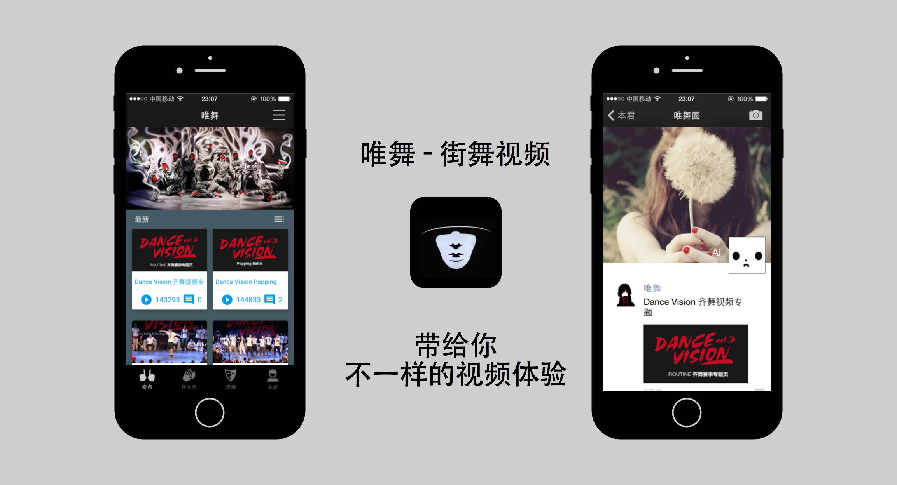
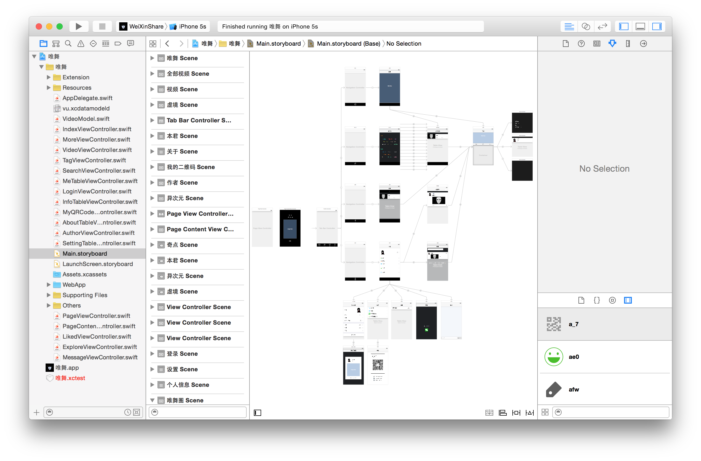

# Vu
唯舞 - 街舞视频 iOS App [官网](http://www.vhiphop.com)

小人常足不出户，虽闲情寡欲，但尤好赏舞，子曰：唯舞独尊。若于街市中观舞，余自幼体弱多病，出门远行，累觉不爱。幸有一网站，名之唯舞，上有万千视频多不胜数随君把玩，卧榻倚床，每有会意便欣然忘食，不亦乐乎。然每访其网站，观其视频，日久天长，实感不便矣。久寻客户端不得，怅然不知所以，遂做此软体，方便自己，亦益于他人。以上。

乙未年八月三十日，小幽居士

## Quick Look

## Install

This app is NOT available on App Store, but you can get it from [pre.im](http://pre.im/1820).

Also, You can download the source code, rebuild it in Xcode7 and then you can run and test it on your iPhone device.

## Requires

Because it has not used `Autolayout` and `Size Classes`(will fix it later), only compatible with iPhone 5 and 5s, also requires iOS 8.4 and up!

## Screenshots

